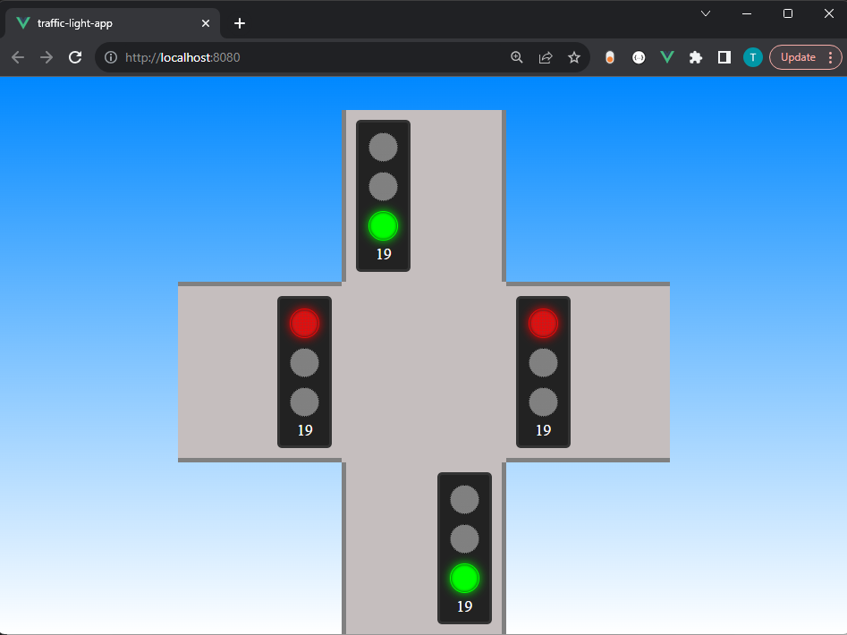
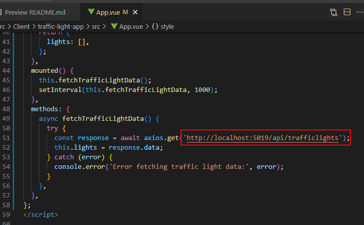
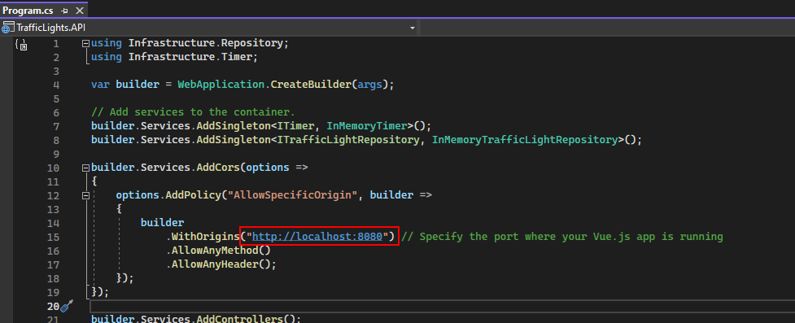
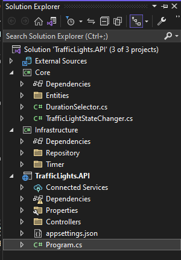
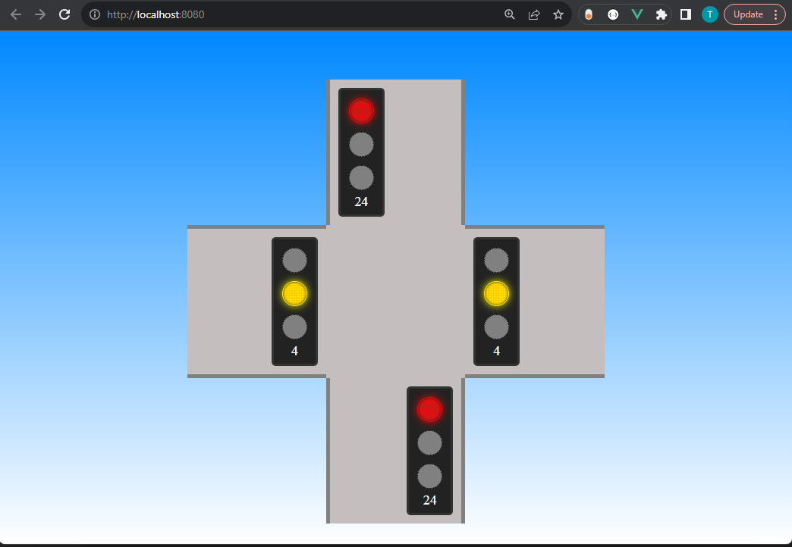
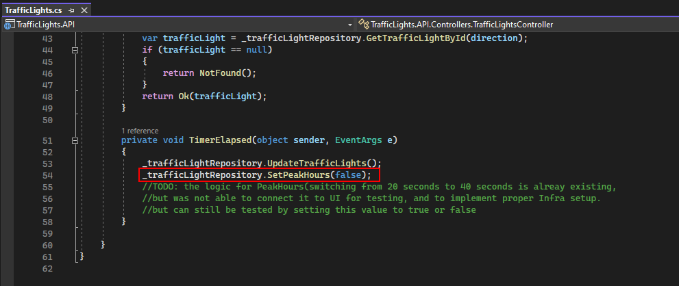

# Traffic Lights API and Client

## Table of Contents
- [About the Project](#about-the-project)
- [Installation](#installation)
- [Running the API Server](#running-the-api-server)
- [Running the Client](#running-the-client)
- [Connecting API to Client](#connecting-api-to-client)
- [Project Structure](#project-structure)
- [Features](#features)
- [Contact](#contact)

## About the Project

This project consists of an API created using ASP.NET WebAPI and a front-end application developed using Vue.js.

## Installation

1. Download the `src` folder from this repository.

## Running the API Server

1. Open the `TrafficLights.API.sln` solution file located in `TrafficLights/src/Api/TrafficLights.API`.

2. Build and run the solution using your preferred development environment.

## Running the Client

1. Follow the instructions below to run the Vue.js application located in `TrafficLights/src/Client/traffic-light-app`:

    ```bash
    # Navigate to the client directory
    cd TrafficLights/src/Client/traffic-light-app
    
    # Install dependencies
    npm install
    
    # Run the application
    npm run serve
    ```

2. Access the client application in your web browser at `http://localhost:8080` (or the URL provided in the console).

    
## Connecting API to Client

The project is configured to use default ports. If ports were changed, you can set up the connection as follows:

### API Server

- Add CORS settings to allow the client to access the API.
    
    `src\Api\TrafficLights.API\Program.cs`

    

### Client

- Update the API URL in Client Applicaction to match the API server's new address if necessary.

    `src\Client\traffic-light-app\src\App.vue`

    


## Project Structure

The API server is divided into three projects: Core, Infrastructure, and API.



## Features

- The green light runs for 20 seconds.
- The light turns yellow for 5 seconds.
- Afterward, the red light is illuminated.
- After 4 seconds of the red light, cross traffic becomes green.
- The cycle then repeats.





**Note**: While changing the duration logic was included, a time-based logic implementation was not completed due to time constraints. You can test different durations manually by changing this flag.




## Contact

If you have any questions, issues, or feedback regarding this project, feel free to contact me:

- **Email**: [timothy812c@gmail.com](mailto:timothy812c@gmail.com)

I welcome your input and look forward to hearing from you!